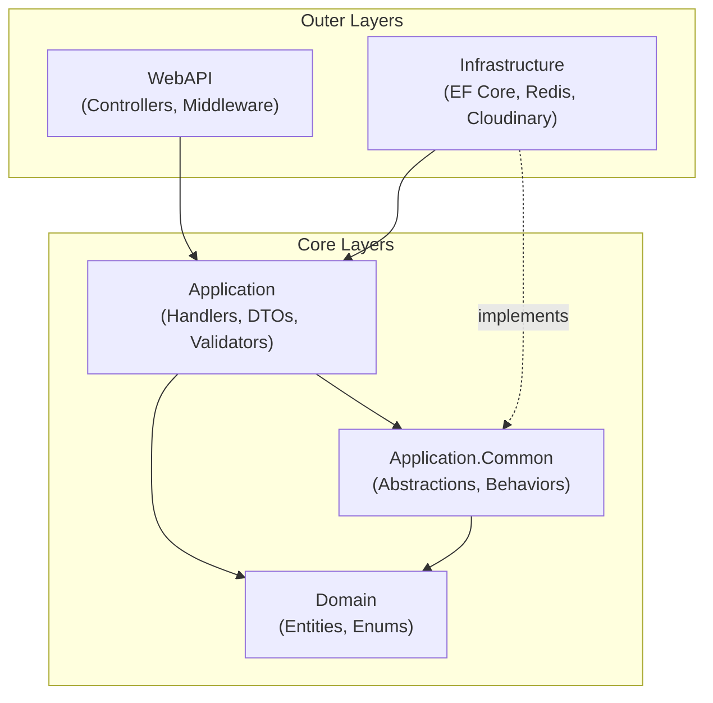
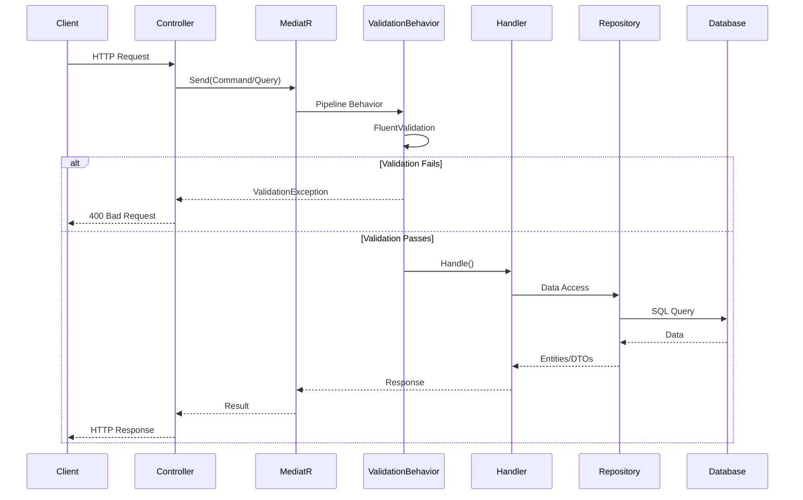

# Architecture Overview

ZTino_Shop backend implements **Onion Architecture** (also known as Clean Architecture), ensuring separation of concerns and testability.

## Layer Diagram

**Dependency Rule**: Dependencies always point inward. Domain has no dependencies; outer layers depend on inner layers.

## Request Flow

## Layer Communication

| From | To | How |
|------|-----|-----|
| WebAPI | Application | MediatR commands/queries |
| Application | Domain | Direct entity usage |
| Application | Infrastructure | Via abstractions in Application.Common |
| Infrastructure | Application.Common | Implements interfaces |

## Key Design Decisions

1. **CQRS without Event Sourcing**: Commands and queries are separated for clarity, but share the same database for simplicity.

2. **Feature-based organization**: Code is organized by business feature (Auth, Products, Carts, Orders), not by technical concern.

3. **Pipeline Behaviors**: Cross-cutting concerns (validation, logging) are handled via MediatR pipeline behaviors.

4. **Repository per Aggregate**: Each feature has its own repository interface, implemented in Infrastructure.

## Related Documentation

- [Layer Responsibilities](layer-responsibilities.md) - Detailed breakdown of each layer
- [Request Flow](request-flow.md) - Step-by-step request tracing
- [Directory Structure](directory-structure.md) - Project folder organization
