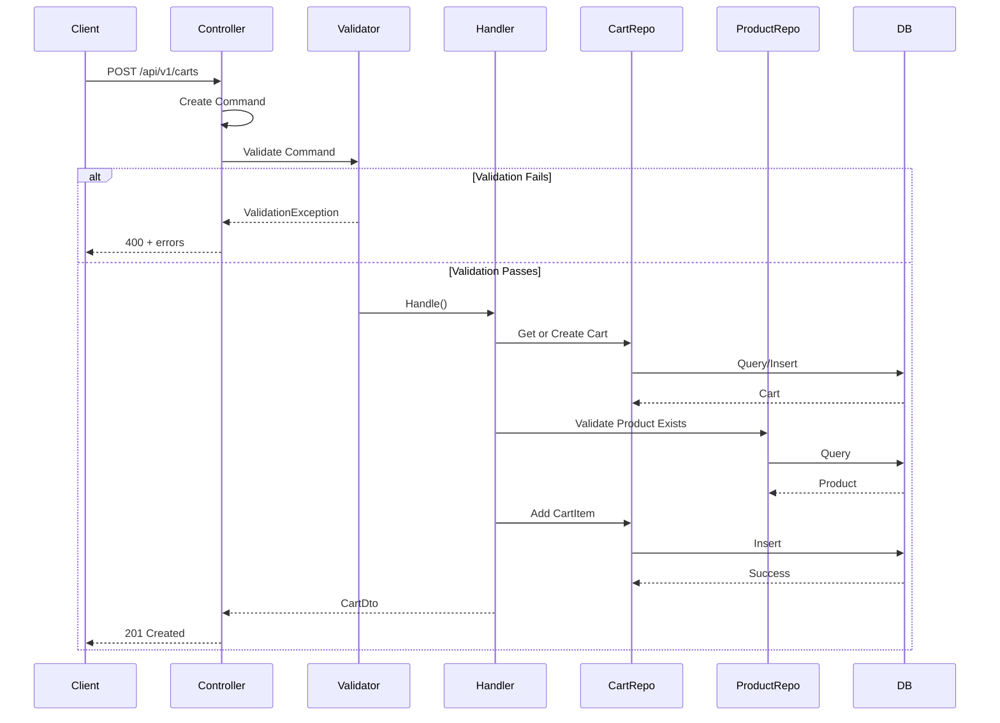
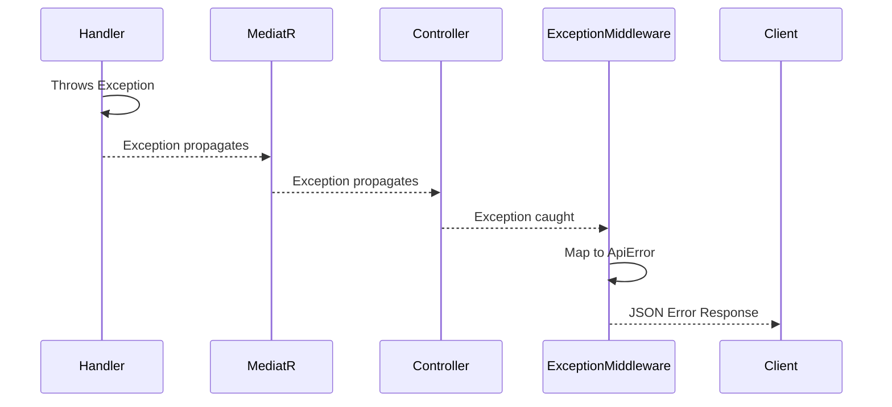

# Request Flow

This document traces a request through the entire system, from HTTP to database and back.

## Example: Get Product by ID

Let's trace `GET /api/v1/products/{id}`:

### 1. HTTP Layer (WebAPI)

**File**: `ZTino_Shop/src/WebAPI/Controllers/v1/Products/ProductsController.cs`

The request hits the controller:
- Route matching determines the controller and action
- Model binding extracts the `id` parameter
- Controller creates a Query object and sends it via MediatR

### 2. MediatR Pipeline

**File**: `ZTino_Shop/src/Application/Features/Products/v1/Queries/GetProductById/`

The request enters the MediatR pipeline:

```
Query Object
    │
    ▼
┌─────────────────────────────┐
│   ValidationBehavior        │  ◄── Validates request with FluentValidation
│   (if validators exist)     │      Throws ValidationException if invalid
└─────────────────────────────┘
    │
    ▼
┌─────────────────────────────┐
│   GetProductByIdHandler     │  ◄── Business logic execution
│                             │
└─────────────────────────────┘
```

### 3. Handler Execution

**Files**:
- Query: `GetProductByIdQuery.cs`
- Handler: `GetProductByIdHandler.cs`

The handler:
1. Receives the query with product ID
2. Calls the repository to fetch data
3. Maps entity to DTO using AutoMapper
4. Returns the DTO

### 4. Repository Layer

**Files**:
- Interface: `ZTino_Shop/src/Application/Features/Products/v1/Repositories/IProductRepository.cs`
- Implementation: `ZTino_Shop/src/Infrastructure/Products/ProductRepository.cs`

The repository:
1. Uses EF Core DbSet to query the database
2. Includes related entities (eager loading)
3. Projects to entities or DTOs
4. Returns data to handler

### 5. Response Pipeline

The response travels back:

```
Handler returns DTO
    │
    ▼
MediatR returns to Controller
    │
    ▼
Controller returns ActionResult
    │
    ▼
┌─────────────────────────────┐
│   ApiResponseFilter         │  ◄── Wraps response in standard envelope
└─────────────────────────────┘
    │
    ▼
HTTP Response to Client
```

---

## Example: Create Cart Item

Let's trace `POST /api/v1/carts`:

### Flow



### Key Points

1. **Validation first**: FluentValidation runs before handler
2. **Business rules in handler**: Stock check, price validation
3. **Multiple repositories**: Handler may use several repositories
4. **Transaction**: All changes saved together

---

## Exception Handling Flow

When an exception occurs anywhere in the pipeline:



**Exception Mapping** (from `ExceptionHandlingMiddleware`):

| Exception Type | HTTP Status | Error Type |
|---------------|-------------|------------|
| `ValidationException` | 400 | `validation-error` |
| `NotFoundException` | 404 | `not-found` |
| `ConflictException` | 409 | `conflict` |
| `ForbiddenException` | 403 | `forbidden` |
| `BusinessRuleException` | 400 | `business-rule-violation` |
| `UnauthorizedAccessException` | 401 | `unauthorized` |
| Other | 500 | `internal-server-error` |

---

## Key Files in Request Flow

| Step | File Location |
|------|---------------|
| Controller | `ZTino_Shop/src/WebAPI/Controllers/v1/{Feature}/` |
| Command/Query | `ZTino_Shop/src/Application/Features/{Feature}/v1/Commands/` or `Queries/` |
| Validator | Same folder as Command/Query |
| Handler | Same folder as Command/Query |
| Repository Interface | `ZTino_Shop/src/Application/Features/{Feature}/v1/Repositories/` |
| Repository Implementation | `ZTino_Shop/src/Infrastructure/{Feature}/` |
| Exception Middleware | `ZTino_Shop/src/WebAPI/Middleware/ExceptionHandling/` |
| Response Filter | `ZTino_Shop/src/WebAPI/Filters/Response/` |
