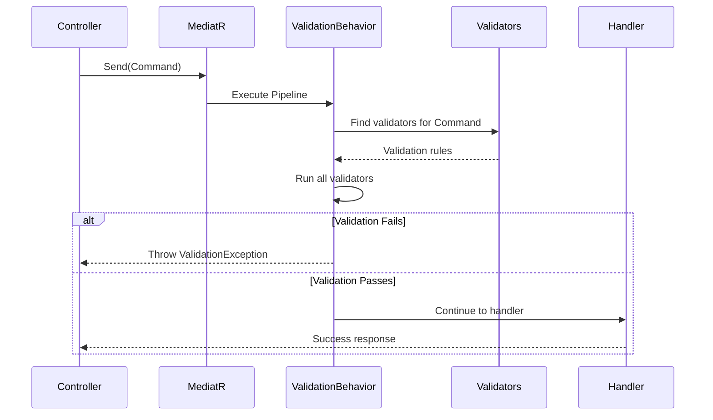

# Validation

This document explains the request validation strategy using FluentValidation.

## Overview

Validation is handled via:
- **FluentValidation**: Rule definition library
- **MediatR Pipeline Behavior**: Automatic validation execution



---

## ValidationBehavior

**Location**: `ZTino_Shop/src/Application.Common/Behaviors/ValidationBehavior.cs`

### How It Works

1. MediatR invokes behavior before handler
2. Behavior finds all `IValidator<TRequest>` implementations
3. Runs all validators in parallel
4. Collects all validation failures
5. Throws `ValidationException` if any failures
6. Allows handler execution if all pass

---

## Creating Validators

### Location

Validators live next to their commands/queries:

```
Commands/CreateProduct/
├── CreateProductCommand.cs
├── CreateProductHandler.cs
└── CreateProductValidator.cs    ← Validator here
```

### Validator Structure

```csharp
public class CreateProductValidator : AbstractValidator<CreateProductCommand>
{
    public CreateProductValidator()
    {
        RuleFor(x => x.Name)
            .NotEmpty()
            .MaximumLength(100);

        RuleFor(x => x.Price)
            .GreaterThan(0);

        RuleFor(x => x.CategoryId)
            .GreaterThan(0);
    }
}
```

---

## Common Validation Rules

| Rule | Purpose |
|------|---------|
| `.NotEmpty()` | Required field |
| `.MaximumLength(n)` | String length limit |
| `.GreaterThan(n)` | Minimum value |
| `.GreaterThanOrEqualTo(n)` | Minimum inclusive |
| `.EmailAddress()` | Email format |
| `.Must(predicate)` | Custom rule |
| `.MustAsync(asyncPredicate)` | Async custom rule |

---

## Async Validation

For database checks:

```csharp
public class CreateProductValidator : AbstractValidator<CreateProductCommand>
{
    public CreateProductValidator(IProductRepository repository)
    {
        RuleFor(x => x.Sku)
            .MustAsync(async (sku, ct) => !await repository.SkuExistsAsync(sku))
            .WithMessage("SKU already exists");
    }
}
```

Validators can inject services via constructor.

---

## Validation Error Response

When validation fails, the API returns:

```json
{
  "success": false,
  "error": {
    "type": "validation-error",
    "message": "Validation failed.",
    "details": {
      "Name": [
        "Name is required",
        "Name must not exceed 100 characters"
      ],
      "Price": [
        "Price must be greater than 0"
      ]
    }
  }
}
```

HTTP Status: **400 Bad Request**

---

## Registration

Validators are auto-discovered by MediatR registration.

**Location**: `ZTino_Shop/src/WebAPI/DependencyInjection/Application/MediatRRegistration.cs`

FluentValidation validators from the Application assembly are registered automatically.

---

## Best Practices

1. **Validate early**: All input validation in validators
2. **Clear messages**: User-friendly error messages
3. **One validator per request**: Keeps validation focused
4. **Use async for DB checks**: Don't block threads
5. **Group related rules**: Use `RuleFor` once per property
6. **Validate business rules in handlers**: Complex logic stays in handlers

---

## Validation vs Business Rules

| Concern | Location | Example |
|---------|----------|---------|
| Input validation | Validator | "Name is required" |
| Business rules | Handler | "Cannot order more than stock quantity" |

Validators check format/structure. Handlers check domain rules.
