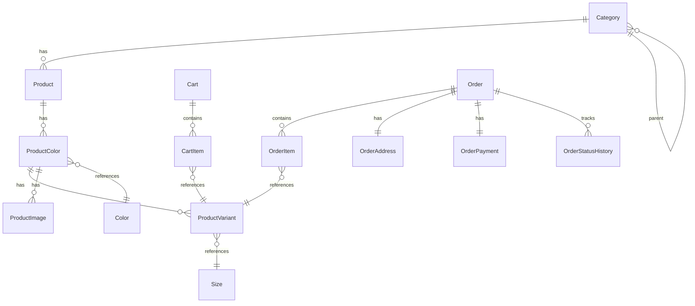

# Entity Configurations

This document explains the EF Core Fluent API configurations for domain entities.

## Overview

Entity configurations:
- Define table mappings
- Configure relationships
- Set column constraints
- Establish indexes

All configurations are in `ZTino_Shop/src/Infrastructure/Persistence/Configurations/`.

## Configuration Pattern

Each entity has a dedicated configuration class:

```csharp
public class ProductConfiguration : IEntityTypeConfiguration<Product>
{
    public void Configure(EntityTypeBuilder<Product> builder)
    {
        // Configuration here
    }
}
```

Applied in `ApplicationDbContext.OnModelCreating()`:

```csharp
builder.ApplyConfiguration(new ProductConfiguration());
```

---

## Configuration Files

### Products

**Location**: `ZTino_Shop/src/Infrastructure/Persistence/Configurations/Products/`

| File | Entity |
|------|--------|
| `ProductConfiguration.cs` | Product |
| `ProductColorConfiguration.cs` | ProductColor |
| `ProductVariantConfiguration.cs` | ProductVariant |
| `ProductImageConfiguration.cs` | ProductImage |
| `CategoryConfiguration.cs` | Category |
| `ColorConfiguration.cs` | Color |
| `SizeConfiguration.cs` | Size |

### Carts

**Location**: `ZTino_Shop/src/Infrastructure/Persistence/Configurations/Carts/`

| File | Entity |
|------|--------|
| `CartConfiguration.cs` | Cart |
| `CartItemConfiguration.cs` | CartItem |

### Orders

**Location**: `ZTino_Shop/src/Infrastructure/Persistence/Configurations/Orders/`

| File | Entity |
|------|--------|
| `OrderConfiguration.cs` | Order |
| `OrderItemConfiguration.cs` | OrderItem |
| `OrderAddressConfiguration.cs` | OrderAddress |
| `OrderPaymentConfiguration.cs` | OrderPayment |
| `OrderStatusHistoryConfiguration.cs` | OrderStatusHistory |

### Auth

**Location**: `ZTino_Shop/src/Infrastructure/Persistence/Configurations/Auth/`

| File | Entity |
|------|--------|
| `RefreshTokenConfiguration.cs` | RefreshToken |

### Other

**Location**: `ZTino_Shop/src/Infrastructure/Persistence/Configurations/`

| Folder | Files |
|--------|-------|
| `Finances/` | `InvoiceConfiguration.cs` |
| `Stats/` | `DailyRevenueStatsConfiguration.cs`, `ProductSalesStatsConfiguration.cs` |

---

## Common Configurations

### Primary Keys

```csharp
builder.HasKey(e => e.Id);
```

Most entities use `int` or `Guid` primary keys.

### Required Fields

```csharp
builder.Property(e => e.Name)
    .IsRequired()
    .HasMaxLength(100);
```

### Decimal Precision

```csharp
builder.Property(e => e.Price)
    .HasColumnType("decimal(18,2)");
```

---

## Relationship Configurations

### One-to-Many

```csharp
// Product has many ProductColors
builder.HasMany(p => p.ProductColors)
    .WithOne(pc => pc.Product)
    .HasForeignKey(pc => pc.ProductId)
    .OnDelete(DeleteBehavior.Cascade);
```

### One-to-One

```csharp
// Order has one OrderAddress
builder.HasOne(o => o.Address)
    .WithOne(a => a.Order)
    .HasForeignKey<OrderAddress>(a => a.OrderId);
```

### Self-Referencing (Category Hierarchy)

```csharp
builder.HasOne(c => c.Parent)
    .WithMany(c => c.Children)
    .HasForeignKey(c => c.ParentId)
    .OnDelete(DeleteBehavior.Restrict);
```

---

## Delete Behaviors

| Behavior | Description |
|----------|-------------|
| `Cascade` | Delete children when parent deleted |
| `Restrict` | Prevent parent deletion if children exist |
| `SetNull` | Set FK to null when parent deleted |
| `NoAction` | Database decides (usually errors) |

### Project Conventions

- **Aggregate children**: Cascade delete
- **Reference entities**: Restrict delete

---

## Indexes

For query performance:

```csharp
builder.HasIndex(e => e.Email)
    .IsUnique();

builder.HasIndex(e => e.CategoryId);
```

---

## Naming Conventions

The project uses default EF Core conventions:
- Table names match DbSet property names
- Column names match property names
- Foreign keys are `{Entity}Id`

Exceptions:
- Identity tables renamed (`AppUsers`, `AppRoles`)

---

## Key Relationships Summary



---

## Best Practices

1. **One configuration per entity**: Keeps files focused
2. **Configure all relationships explicitly**: Don't rely on conventions
3. **Set appropriate max lengths**: Optimize storage
4. **Use indexes for query columns**: Foreign keys, search fields
5. **Configure cascade carefully**: Prevent unintended data loss
