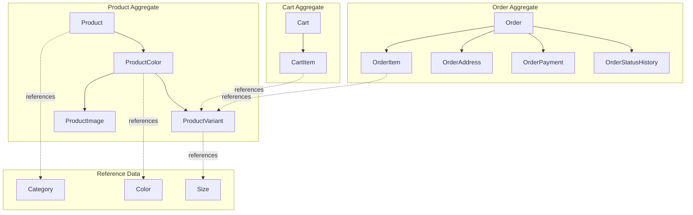

# Domain Modeling

The Domain layer is the heart of Clean Architecture - it contains business entities and rules with zero external dependencies.

## Aggregate Structure

## Aggregates Explained

### Product Aggregate
**Root**: `Product`

| Entity | Location | Purpose |
|--------|----------|---------|
| `Product` | `ZTino_Shop/src/Domain/Models/Products/Product.cs` | Main product info (name, description, price) |
| `ProductColor` | `ZTino_Shop/src/Domain/Models/Products/ProductColor.cs` | Color variation of a product |
| `ProductVariant` | `ZTino_Shop/src/Domain/Models/Products/ProductVariant.cs` | Size + color combination with stock |
| `ProductImage` | `ZTino_Shop/src/Domain/Models/Products/ProductImage.cs` | Images for a product color |

**Ownership**: Product owns ProductColors → ProductColor owns Variants and Images

### Cart Aggregate
**Root**: `Cart`

| Entity | Location | Purpose |
|--------|----------|---------|
| `Cart` | `ZTino_Shop/src/Domain/Models/Carts/Cart.cs` | Shopping cart container |
| `CartItem` | `ZTino_Shop/src/Domain/Models/Carts/CartItem.cs` | Item in cart with quantity |

**Key property**: `UserId` (nullable Guid) - supports both guest and authenticated carts

### Order Aggregate
**Root**: `Order`

| Entity | Location | Purpose |
|--------|----------|---------|
| `Order` | `ZTino_Shop/src/Domain/Models/Orders/Order.cs` | Order with status, totals |
| `OrderItem` | `ZTino_Shop/src/Domain/Models/Orders/OrderItem.cs` | Line item with price snapshot |
| `OrderAddress` | `ZTino_Shop/src/Domain/Models/Orders/OrderAddress.cs` | Shipping address |
| `OrderPayment` | `ZTino_Shop/src/Domain/Models/Orders/OrderPayment.cs` | Payment details |
| `OrderStatusHistory` | `ZTino_Shop/src/Domain/Models/Orders/OrderStatusHistory.cs` | Status change log |

---

## Reference Entities

These are standalone entities referenced by aggregates:

| Entity | Location | Purpose |
|--------|----------|---------|
| `Category` | `ZTino_Shop/src/Domain/Models/Products/Category.cs` | Product categories (hierarchical) |
| `Color` | `ZTino_Shop/src/Domain/Models/Products/Color.cs` | Color options |
| `Size` | `ZTino_Shop/src/Domain/Models/Products/Size.cs` | Size options |

---

## Business Logic Location

### Where is business logic?

| Logic Type | Location | Example |
|------------|----------|---------|
| **Simple calculations** | Domain entities | Order total calculation |
| **Use case orchestration** | Application handlers | Cart checkout flow |
| **Validation rules** | FluentValidation validators | Stock availability check |
| **Complex domain rules** | Domain services or handlers | Price calculation with discounts |

### Price Calculation Example

**Cart total calculation** is handled in the Application layer:

**Location**: `ZTino_Shop/src/Application/Features/Carts/v1/Queries/`

The handler:
1. Fetches cart with items
2. Joins with product variants for current prices
3. Calculates totals (quantity × unit price)
4. Returns DTO with computed values

**Why in Application, not Domain?**
- Requires database access for current prices
- Domain entities are persistence-ignorant
- Keeps Domain layer pure and testable

---

## Domain Design Principles

### 1. Persistence Ignorance
Domain entities have no knowledge of EF Core:
- No `[Table]`, `[Column]` attributes
- No navigation property configurations
- All ORM config is in `Infrastructure/Persistence/Configurations/`

### 2. Entity Identity
Entities use meaningful IDs:
- Most use `Guid` for distributed uniqueness
- Some use `int` for reference data (Size, Color)

### 3. Encapsulation
Entities protect their invariants:
- Properties with appropriate access modifiers
- Business methods for state changes

---

## Domain Events (Not Currently Implemented)

The current design does not use domain events. For future extension:

**Potential events**:
- `OrderPlaced` - Trigger inventory update, email
- `PaymentReceived` - Update order status
- `StockDepleted` - Notify admin

**Implementation option**: MediatR notifications with handlers in Application layer.

---

## Entity Relationship Summary

| Parent | Child | Relationship | Cascade |
|--------|-------|--------------|---------|
| Product | ProductColor | One-to-Many | Delete |
| ProductColor | ProductVariant | One-to-Many | Delete |
| ProductColor | ProductImage | One-to-Many | Delete |
| Category | Product | One-to-Many | Restrict |
| Cart | CartItem | One-to-Many | Delete |
| Order | OrderItem | One-to-Many | Delete |
| Order | OrderAddress | One-to-One | Delete |
| Order | OrderPayment | One-to-One | Delete |
| Order | OrderStatusHistory | One-to-Many | Delete |
