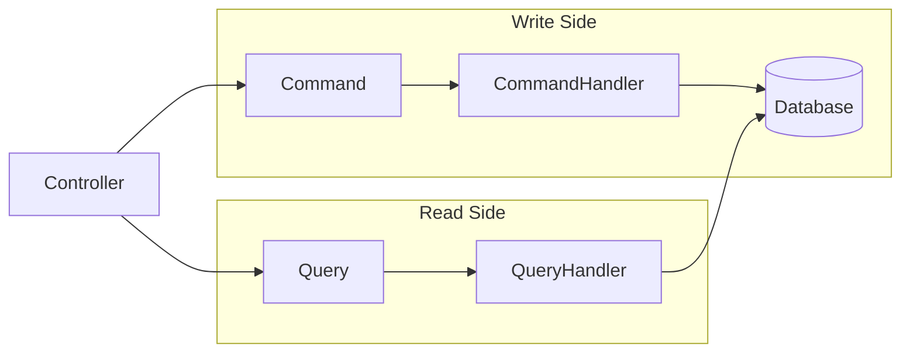

# CQRS Pattern

This document explains the Command Query Responsibility Segregation (CQRS) pattern implementation using MediatR.

## Overview

CQRS separates read and write operations:
- **Commands**: Change state (Create, Update, Delete)
- **Queries**: Read state without modification



## MediatR Integration

MediatR provides the messaging infrastructure:

1. **Request** → Command or Query object
2. **Handler** → Processes the request
3. **Pipeline** → Behaviors wrap handler execution

---

## Command Structure

### Request (Command)
**Location**: `ZTino_Shop/src/Application/Features/{Feature}/v1/Commands/{CommandName}/`

Commands implement `IRequest<TResponse>`:
- Contain data needed for the operation
- Typically named as verb + noun (e.g., `CreateProductCommand`)

### Handler
Handlers implement `IRequestHandler<TRequest, TResponse>`:
- Receive the command
- Execute business logic
- Interact with repositories
- Return result

### Validator
Validators implement `IValidator<TCommand>`:
- Define validation rules using FluentValidation
- Run automatically via `ValidationBehavior`
- Throw `ValidationException` on failure

---

## Query Structure

### Request (Query)
Queries follow the same pattern as commands:
- Implement `IRequest<TResponse>`
- Named as Get/List + noun (e.g., `GetProductByIdQuery`)

### Handler
- Focuses on data retrieval
- Usually projects to DTOs
- May include filtering, paging, sorting

---

## File Organization

```
Commands/
├── CreateProduct/
│   ├── CreateProductCommand.cs      # Request
│   ├── CreateProductHandler.cs      # Handler
│   └── CreateProductValidator.cs    # Validator
├── UpdateProduct/
│   ├── UpdateProductCommand.cs
│   ├── UpdateProductHandler.cs
│   └── UpdateProductValidator.cs
└── DeleteProduct/
    ├── DeleteProductCommand.cs
    └── DeleteProductHandler.cs

Queries/
├── GetProductById/
│   ├── GetProductByIdQuery.cs
│   └── GetProductByIdHandler.cs
└── GetProducts/
    ├── GetProductsQuery.cs
    └── GetProductsHandler.cs
```

---

## Pipeline Behaviors

Behaviors wrap handler execution (cross-cutting concerns):

```
Request
    │
    ▼
┌─────────────────────────────┐
│   ValidationBehavior        │  ← Validates request
└─────────────────────────────┘
    │
    ▼
┌─────────────────────────────┐
│   [Future: LoggingBehavior] │  ← Logs request/response
└─────────────────────────────┘
    │
    ▼
┌─────────────────────────────┐
│   Handler                   │  ← Business logic
└─────────────────────────────┘
    │
    ▼
Response
```

### ValidationBehavior
**Location**: `ZTino_Shop/src/Application.Common/Behaviors/ValidationBehavior.cs`

- Finds all validators for the request type
- Runs all validations in parallel
- Throws `ValidationException` with all errors if any fail
- Allows handler execution if all pass

---

## Controller Integration

Controllers dispatch commands/queries via MediatR:

```
Controller receives HTTP request
    │
    ▼
Creates Command/Query object
    │
    ▼
Calls _mediator.Send(request)
    │
    ▼
Returns result as HTTP response
```

---

## Best Practices

### Commands

1. **Single Responsibility**: One command per use case
2. **Validation**: Always include a validator
3. **Return minimal data**: Just confirmation or the created entity ID
4. **Use transactions**: For multi-step operations

### Queries

1. **Project to DTOs**: Don't return domain entities
2. **Optimize for read**: Use `AsNoTracking()`, projections
3. **Handle includes carefully**: Avoid N+1 queries
4. **Support filtering/paging**: For list queries

### General

1. **Keep handlers focused**: Delegate to services for complex logic
2. **Use cancellation tokens**: Pass `CancellationToken` throughout
3. **Handle not found**: Throw `NotFoundException` when entity missing
4. **Log appropriately**: Use structured logging

---

## Example: Create Product Flow

1. **Controller** receives `POST /api/v1/products`
2. **Controller** creates `CreateProductCommand` from request body
3. **Controller** calls `_mediator.Send(command)`
4. **MediatR** finds `CreateProductValidator`
5. **ValidationBehavior** validates the command
6. **MediatR** finds `CreateProductHandler`
7. **Handler** creates entity, calls repository
8. **Handler** returns created product DTO
9. **Controller** returns `201 Created` with DTO

---

## Why CQRS?

| Benefit | Explanation |
|---------|-------------|
| **Separation** | Read and write concerns don't mix |
| **Scalability** | Can optimize reads/writes independently |
| **Testability** | Handlers are easy to unit test |
| **Flexibility** | Easy to add behaviors (caching, logging) |
| **Clarity** | Clear intent in code |
