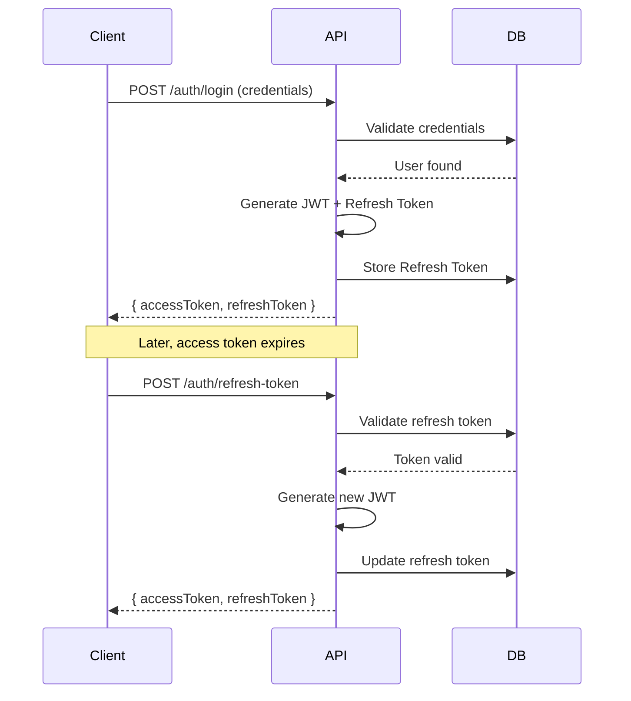
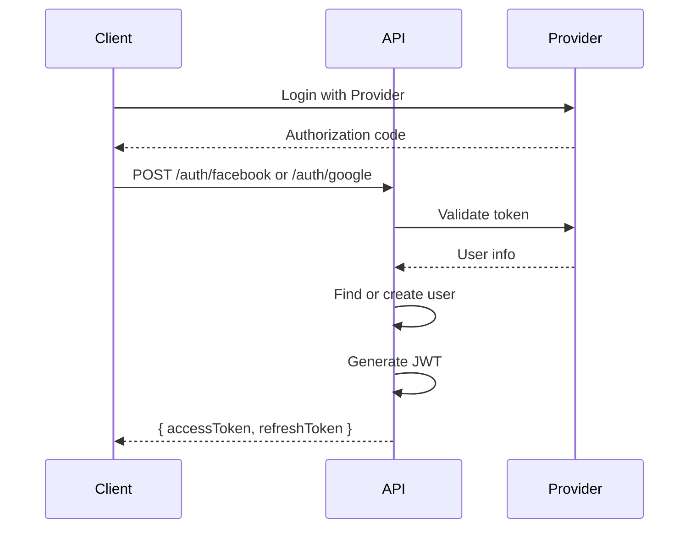

# Authentication

This document explains the authentication mechanisms in ZTino_Shop backend.

## Overview

The system supports multiple authentication methods:
- **JWT (JSON Web Tokens)** - Primary method
- **OAuth 2.0** - Facebook, Google providers
- **Refresh Tokens** - Session extension

## JWT Authentication

### Token Structure

**Access Token**:
- Short-lived (15 minutes default)
- Contains user claims (ID, email, roles)
- Signed with secret key

**Refresh Token**:
- Long-lived (7 days default)
- Stored in database
- Used to obtain new access tokens

### Configuration

**Location**: `ZTino_Shop/src/WebAPI/appsettings.template.json`

```json
{
  "Jwt": {
    "Secret": "your-secret-key-here",
    "ValidIssuer": "ZTinoShop",
    "ValidAudience": "ZTinoShopUsers",
    "AccessTokenExpiryMinutes": 15,
    "RefreshTokenExpiryDays": 7
  }
}
```

### Token Flow



---

## Key Files

### JWT Services
| File | Location | Purpose |
|------|----------|---------|
| JWT Options | `ZTino_Shop/src/Infrastructure/Auth/Options/JwtOptions.cs` | Configuration |
| Token Service | `ZTino_Shop/src/Infrastructure/Auth/Services/Jwt/` | Token generation |
| JWT Registration | `ZTino_Shop/src/WebAPI/DependencyInjection/Security/JwtRegistration.cs` | DI setup |

### Identity Models
| File | Location | Purpose |
|------|----------|---------|
| ApplicationUser | `ZTino_Shop/src/Infrastructure/Auth/Models/ApplicationUser.cs` | User entity |
| ApplicationRole | `ZTino_Shop/src/Infrastructure/Auth/Models/ApplicationRole.cs` | Role entity |
| RefreshToken | `ZTino_Shop/src/Infrastructure/Auth/Models/RefreshToken.cs` | Token persistence |

### Auth Commands
**Location**: `ZTino_Shop/src/Application/Features/Auth/v1/Commands/`

| Command | Purpose |
|---------|---------|
| Login | Authenticate with email/password |
| Register | Create new user account |
| RefreshToken | Get new access token |
| Logout | Invalidate refresh token |
| ChangePassword | Update password |

---

## OAuth Integration

### Supported Providers

| Provider | Configuration Key |
|----------|------------------|
| Facebook | `FacebookAuth:AppId`, `FacebookAuth:AppSecret` |
| Google | `GoogleAuth:ClientId`, `GoogleAuth:ClientSecret` |

### OAuth Flow



### OAuth Services
**Location**: `ZTino_Shop/src/Application/Features/Auth/v1/Services/`

| Folder | Purpose |
|--------|---------|
| `Command/` | OAuth command handlers |
| `Query/` | User info queries |

---

## Identity Setup

### ASP.NET Core Identity

The system uses ASP.NET Core Identity with customizations:

**Registration**: `ZTino_Shop/src/WebAPI/DependencyInjection/Security/IdentityRegistration.cs`

- Custom `ApplicationUser` extends `IdentityUser<Guid>`
- Custom `ApplicationRole` extends `IdentityRole<Guid>`
- Password requirements configured
- User validation rules

### Identity Abstractions

**Location**: `ZTino_Shop/src/Application.Common/Abstractions/Identity/`

| Interface | Purpose |
|-----------|---------|
| `ICurrentUser` | Access authenticated user context |
| `IIdentityService` | User management operations |

### ICurrentUser

Provides access to the current authenticated user:
- `UserId` - User's GUID
- `Email` - User's email
- `IsAuthenticated` - Auth status

Implementation reads from `HttpContext.User` claims.

---

## Request Authentication

### Protected Endpoints

Controllers use `[Authorize]` attribute:
- Applied at controller or action level
- Can specify roles: `[Authorize(Roles = "Admin")]`

### Unprotected Endpoints

Public endpoints use `[AllowAnonymous]`:
- Login, Register, Product listing
- Password reset

---

## Security Headers

The JWT middleware validates:
1. Token signature (using secret key)
2. Token expiry
3. Issuer and audience claims

Invalid tokens result in `401 Unauthorized`.

---

## Token Storage Recommendations

### Client-Side

| Platform | Access Token | Refresh Token |
|----------|-------------|---------------|
| Web (SPA) | Memory | HttpOnly cookie or secure storage |
| Mobile | Secure storage | Secure storage |

### Security Best Practices

1. **Never store access tokens in localStorage** - XSS vulnerable
2. **Use HTTPS only** - Prevent token interception
3. **Short access token expiry** - Limit damage if compromised
4. **Rotate refresh tokens** - New refresh token on each use
5. **Revoke on logout** - Remove refresh token from DB
