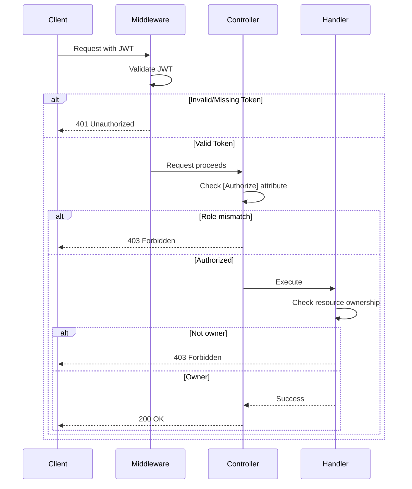

# Authorization

This document explains the authorization mechanisms in ZTino_Shop backend.

## Overview

Authorization determines what authenticated users can do:
- **Role-based**: Admin, User, etc.
- **Resource-based**: Own resources vs. others'
- **Policy-based**: Custom rules (future)

## Role-Based Access Control

### Roles

| Role | Purpose | Typical Access |
|------|---------|----------------|
| Admin | System administration | Full CRUD on all resources |
| User | Regular customer | Own orders, carts; read products |

### Applying Authorization

Controllers and actions use `[Authorize]` attribute:

```
[Authorize]                    → Any authenticated user
[Authorize(Roles = "Admin")]   → Admin only
[AllowAnonymous]               → No auth required
```

### Controller Examples

| Controller | Auth Requirement |
|------------|------------------|
| Auth endpoints | Mixed (login = anonymous, logout = authenticated) |
| Products (read) | Anonymous |
| Products (write) | Admin |
| Carts | Optional (guest carts supported) |
| Orders | Authenticated |
| Manager | Admin |

---

## Manager vs Public Controllers

**Location**: `ZTino_Shop/src/WebAPI/Controllers/v1/`

### Public Controllers
- `Auth/` - Authentication endpoints
- `Products/` - Product catalog (read)
- `Carts/` - Shopping cart
- `Orders/` - User's own orders

### Manager Controllers
- `Manager/` - Admin-only operations
  - Product management
  - Category management
  - Order management
  - User management

---

## Resource-Based Authorization

### Own Resources

Users can only access their own:
- **Orders**: Filter by `UserId` matching current user
- **Cart**: Filter by `UserId` or session ID

### Implementation Pattern

Handlers check ownership:
1. Get current user from `ICurrentUser`
2. Query resources filtered by user ID
3. Return only matching resources

---

## Identity Abstractions

### ICurrentUser

**Location**: `ZTino_Shop/src/Application.Common/Abstractions/Identity/ICurrentUser.cs`

Provides access to authenticated user:
- `UserId` - Current user's GUID
- `Email` - Current user's email
- `IsAuthenticated` - Whether user is logged in

### Implementation

**Location**: `ZTino_Shop/src/Infrastructure/Identity/`

Reads claims from `HttpContext.User`:
- JWT claims are parsed on authentication
- Available throughout request lifecycle

---

## Guest vs Authenticated

### Cart Handling

Carts support both:
- **Guest**: Uses session/device ID
- **Authenticated**: Uses user ID

On login, guest cart can be merged with user cart.

### Order Handling

Orders require authentication:
- User ID stored with order
- Only order owner can view

---

## Authorization Flow



---

## Exception Handling

Authorization failures are mapped to HTTP responses:

| Scenario | Exception | HTTP Status |
|----------|-----------|-------------|
| No token | -  | 401 Unauthorized |
| Invalid token | - | 401 Unauthorized |
| Wrong role | - | 403 Forbidden |
| Not resource owner | `ForbiddenException` | 403 Forbidden |

**Location**: `ZTino_Shop/src/WebAPI/Middleware/ExceptionHandling/ExceptionHandlingMiddleware.cs`

---

## Best Practices

1. **Principle of Least Privilege**: Grant minimum required access
2. **Defense in Depth**: Check at controller AND handler level
3. **Fail Secure**: Default to deny if unclear
4. **Audit**: Log authorization failures
5. **Separation**: Keep admin endpoints in separate controllers

---

## Future Enhancements

### Policy-Based Authorization

For complex rules:
- Custom policies with `IAuthorizationHandler`
- Claims-based decisions
- Resource requirements

### Permission-Based

Granular permissions:
- `products:read`, `products:write`
- `orders:manage:own`, `orders:manage:all`
