# 🛍️ ZTino-Shop


ZTino-Shop is a **full-stack E-Commerce web application** for clothing retail, built with **.NET 8 Web API** for the Backend and **ReactJS 19** for the Frontend.

- The project simulates a real-world e-commerce system and is developed with a clear focus on:
  - Not just making the code "work"
  - But emphasizing **system architecture**, **clear layer separation**, **scalability**, **maintainability**, and **well-structured documentation**

These are core principles required in **professional software development environments** and **production-ready projects**.

---

## 📋 Table of Contents

- [System Architecture](#-system-architecture)
- [Prerequisites](#-prerequisites)
- [Quick Start - Docker (Recommended)](#-quick-start---docker-recommended)
- [Quick Start - Traditional](#-quick-start---traditional)
- [Project Structure](#-project-structure)
- [Service Ports Reference](#-service-ports-reference)
- [Environment Variables](#-environment-variables)
- [Technologies](#-technologies)
- [Documentation](#-documentation)
- [Troubleshooting](#-troubleshooting)
- [Author](#-author)

---

## 🏗️ System Architecture

### High-Level Overview

```mermaid
graph TB
    subgraph Client ["🖥️ Client Layer"]
        Browser["Web Browser"]
    end

    subgraph Frontend ["⚛️ Frontend Layer"]
        Manager["ztino-manager<br/>(Admin Dashboard)<br/>:3001"]
        Web["ztino-web<br/>(Customer Store)<br/>:3000"]
    end

    subgraph Nginx ["🔀 Nginx Reverse Proxy"]
        NG1["Nginx (Manager)"]
        NG2["Nginx (Web)"]
    end

    subgraph Backend ["🔧 Backend Layer"]
        API["ZTino_Shop API<br/>(.NET 8 Web API)<br/>:8080"]
    end

    subgraph Data ["💾 Data Layer"]
        SQL["SQL Server<br/>:1433"]
        Redis["Redis Cache<br/>:6379"]
    end

    subgraph External ["☁️ External Services"]
        Cloudinary["Cloudinary<br/>(Image Storage)"]
        OAuth["OAuth Providers<br/>(Google, Facebook)"]
    end

    Browser --> Manager
    Browser --> Web
    Manager --> NG1
    Web --> NG2
    NG1 -->|/api/*| API
    NG2 -->|/api/*| API
    API --> SQL
    API --> Redis
    API --> Cloudinary
    API --> OAuth
```



### Architecture Principles

| Component | Architecture | Description |
|-----------|--------------|-------------|
| **Backend** | Monolithic + Onion Architecture | Clear layer separation, CQRS pattern with MediatR |
| **Frontend** | Feature-Based Architecture | Code organized by business domain, reusable hooks |
| **Communication** | RESTful API | JWT authentication, role-based authorization |

---

## 📌 Prerequisites

### Option 1: Docker (Recommended)

| Tool | Version | Download |
|------|---------|----------|
| **Docker Desktop** | v4.x+ | [docker.com/products/docker-desktop](https://www.docker.com/products/docker-desktop/) |
| **Git** | Any | [git-scm.com](https://git-scm.com/) |
| **WSL2** (Windows only) | - | [Microsoft Docs](https://docs.microsoft.com/en-us/windows/wsl/install) |

> [!TIP]
> Docker Desktop includes Docker Compose. No additional installation required.

### Option 2: Traditional (Manual Setup)

| Tool | Version | Download |
|------|---------|----------|
| **Node.js** | v18+ | [nodejs.org](https://nodejs.org/) |
| **npm/yarn/pnpm** | Any | Included with Node.js |
| **.NET SDK** | 8.0 | [dotnet.microsoft.com](https://dotnet.microsoft.com/download/dotnet/8.0) |
| **SQL Server** | 2019+ | [microsoft.com/sql-server](https://www.microsoft.com/en-us/sql-server/sql-server-downloads) |
| **Redis** | Any | [redis.io](https://redis.io/download/) (optional) |

---

## 🐳 Quick Start - Docker (Recommended)

> [!NOTE]
> This is the easiest way to run ZTino-Shop. No manual environment setup required!

### Step 1: Clone the Repository

```bash
git clone https://github.com/mduy26100/ZTino-Shop.git
cd ZTino-Shop
```

### Step 2: Create Environment File

Create a `.env` file in the project root:

```env
# Database
SA_PASSWORD=YourStrong@Passw0rd123

# JWT Configuration (optional - has defaults)
# JWT_SECRET=your-super-secret-key-here
# JWT_ISSUER=ZTinoShop
# JWT_AUDIENCE=ZTinoShopUsers

# Cloudinary (optional - for image uploads)
# CLOUDINARY_CLOUD_NAME=your-cloud-name
# CLOUDINARY_API_KEY=your-api-key
# CLOUDINARY_API_SECRET=your-api-secret
```

### Step 3: Start All Services

**Production Mode:**
```bash
docker compose up --build
```

**Development Mode (with Hot Reload):**
```bash
docker compose -f docker-compose.dev.yml up --build
```

### Step 4: Access the Application

| Service | Production URL | Development URL |
|---------|----------------|-----------------|
| **Customer Store** | http://localhost:3000 | http://localhost:5173 |
| **Admin Dashboard** | http://localhost:3001 | http://localhost:5174 |
| **API (Swagger)** | - | http://localhost:5000/swagger |

> [!IMPORTANT]
> Wait for all services to be healthy before accessing. The database may take 30-60 seconds to initialize on first run.

### What Happens When You Run Docker Compose?

1. **SQL Server** starts and waits for health check
2. **Redis** starts for caching
3. **Backend API** builds, runs migrations, and starts
4. **Frontend apps** build and are served via Nginx
5. All services connect on internal Docker network

---

## 🛠️ Quick Start - Traditional

### Step 1: Clone and Configure

```bash
git clone https://github.com/mduy26100/ZTino-Shop.git
cd ZTino-Shop
```

### Step 2: Setup Backend

```bash
cd Backend/ZTino_Shop

# Copy configuration template
cp src/WebAPI/appsettings.template.json src/WebAPI/appsettings.json

# Edit appsettings.json with your settings:
# - ConnectionStrings:DefaultConnection
# - Jwt:Secret, ValidIssuer, ValidAudience
# - Redis:ConnectionString (optional)

# Restore and run
cd src/WebAPI
dotnet restore
dotnet run
```

The API will be available at: `https://localhost:<PORT>/swagger`

### Step 3: Setup Frontend (Manager)

```bash
cd Frontend/ztino-manager

# Install dependencies
npm install

# Create .env file
echo "VITE_API_URL=https://localhost:<BACKEND_PORT>/api/v1" > .env

# Start development server
npm run dev
```

### Step 4: Setup Frontend (Customer Web)

```bash
cd Frontend/ztino-web

# Install dependencies
npm install

# Create .env file
echo "VITE_API_URL=https://localhost:<BACKEND_PORT>/api/v1" > .env

# Start development server
npm run dev
```

---

## 📂 Project Structure

```txt
ZTino-Shop/
│
├── 📁 Frontend/
│   ├── 📁 ztino-manager/        # Admin dashboard (React + Vite)
│   │   ├── README.md            # Detailed documentation
│   │   └── docs/                # Technical docs
│   │
│   └── 📁 ztino-web/            # Customer store (React + Vite)
│       ├── README.md            # Detailed documentation
│       └── docs/                # Technical docs
│
├── 📁 Backend/
│   └── 📁 ZTino_Shop/           # .NET 8 Web API
│       ├── README.md            # Detailed documentation
│       └── docs/                # Technical docs
│
├── 📁 docs/                     # Project-wide documentation
│   └── docker.md                # Docker documentation
│
├── 📄 docker-compose.yml        # Production Docker config
├── 📄 docker-compose.dev.yml    # Development Docker config
├── 📄 .env                      # Environment variables (create this)
│
└── 📄 README.md                 # This file
```

---

## 🔌 Service Ports Reference

### Production Mode (`docker compose up`)

| Service | Container Name | Port | URL | Notes |
|---------|---------------|------|-----|-------|
| SQL Server | ztino-sqlserver | 1433 | - | Connect via SSMS/Azure Data Studio |
| Redis | ztino-redis | 6379 | - | Connect via Redis Insight |
| Backend API | ztino-backend | Internal | - | Only accessible via Nginx proxy |
| Manager Dashboard | ztino-manager | 3001 | http://localhost:3001 | Nginx serves static files |
| Customer Web | ztino-web | 3000 | http://localhost:3000 | Nginx serves static files |

### Development Mode (`docker compose -f docker-compose.dev.yml up`)

| Service | Container Name | Port | URL | Notes |
|---------|---------------|------|-----|-------|
| SQL Server | ztino-sqlserver-dev | 1433 | - | Same as production |
| Redis | ztino-redis-dev | 6379 | - | Same as production |
| Backend API | ztino-backend-dev | 5000 | http://localhost:5000 | Direct API access |
| Manager Dashboard | ztino-manager-dev | 5174 | http://localhost:5174 | Vite HMR enabled |
| Customer Web | ztino-web-dev | 5173 | http://localhost:5173 | Vite HMR enabled |

---

## 🔐 Environment Variables

Create a `.env` file in the project root with these variables:

| Variable | Required | Default | Description |
|----------|----------|---------|-------------|
| `SA_PASSWORD` | Yes | `YourStrong@Passw0rd123` | SQL Server SA password |
| `JWT_SECRET` | No | (from appsettings) | JWT signing key |
| `JWT_ISSUER` | No | (from appsettings) | JWT issuer |
| `JWT_AUDIENCE` | No | (from appsettings) | JWT audience |
| `CLOUDINARY_CLOUD_NAME` | No | - | Cloudinary cloud name |
| `CLOUDINARY_API_KEY` | No | - | Cloudinary API key |
| `CLOUDINARY_API_SECRET` | No | - | Cloudinary API secret |

> [!CAUTION]
> Never commit `.env` files to version control. The `.gitignore` already excludes them.

---

## 🧰 Technologies

### Backend
- .NET 8 Web API
- Entity Framework Core
- MediatR (CQRS)
- FluentValidation
- Microsoft SQL Server
- Redis (Distributed Cache)
- JWT Authentication
- OAuth (Google, Facebook)
- Cloudinary (Image Storage)

### Frontend
- ReactJS 19
- Vite 7
- Ant Design 5
- Tailwind CSS 3
- Axios
- React Router v6

### DevOps
- Docker & Docker Compose
- Nginx (Reverse Proxy)
- Multi-stage Docker builds

---

## 📚 Documentation

### Project-Wide
- [Docker Guide](docs/docker.md) - Complete Docker documentation

### Backend
- [Backend README](Backend/ZTino_Shop/README.md) - Overview and setup
- [Architecture Overview](Backend/ZTino_Shop/docs/architecture/architecture-overview.md)
- [API Standards](Backend/ZTino_Shop/docs/api/api-standards.md)
- [CQRS Pattern](Backend/ZTino_Shop/docs/features/cqrs-pattern.md)

### Frontend - Manager
- [Manager README](Frontend/ztino-manager/README.md) - Overview and setup
- [Architecture](Frontend/ztino-manager/docs/architecture.md)
- [Features Guide](Frontend/ztino-manager/docs/features/README.md)

### Frontend - Customer Web
- [Web README](Frontend/ztino-web/README.md) - Overview and setup
- [Architecture](Frontend/ztino-web/docs/architecture.md)
- [Features Guide](Frontend/ztino-web/docs/features/)

---

## 🔧 Troubleshooting

### Docker Issues

<details>
<summary><strong>Container fails to start with "port already in use"</strong></summary>

Another application is using the required port. Either:
1. Stop the conflicting application
2. Change the port in `docker-compose.yml`

```bash
# Find what's using the port (Windows)
netstat -ano | findstr :3000

# Find what's using the port (Linux/Mac)
lsof -i :3000
```
</details>

<details>
<summary><strong>SQL Server container keeps restarting</strong></summary>

Usually caused by weak password. Ensure `SA_PASSWORD`:
- At least 8 characters
- Contains uppercase, lowercase, numbers, and symbols
- Example: `YourStrong@Passw0rd123`
</details>

<details>
<summary><strong>Frontend can't connect to API</strong></summary>

In Development mode, ensure:
1. Backend is running and healthy
2. `VITE_API_URL` is correctly set
3. CORS is properly configured in backend

In Production mode:
- API is accessed via Nginx proxy at `/api/`
- Check Nginx logs: `docker logs ztino-manager`
</details>

<details>
<summary><strong>Database migrations failed</strong></summary>

Check backend logs:
```bash
docker logs ztino-backend
```

If migrations fail, you may need to:
1. Ensure database is healthy first
2. Check connection string
3. Manually run migrations
</details>

### Traditional Setup Issues

<details>
<summary><strong>Entity Framework migrations error</strong></summary>

```bash
cd Backend/ZTino_Shop/src/WebAPI
dotnet ef database update --project ../Infrastructure/Infrastructure.csproj
```
</details>

<details>
<summary><strong>CORS errors in browser</strong></summary>

Ensure your backend `appsettings.json` includes the frontend URLs in CORS policy.
</details>

---

## 📊 Project Status

### ✅ Completed
- **Product Management** - CRUD, categories, colors, sizes, variants, images
- **Shopping Cart** - Guest & authenticated cart management
- **Authentication** - JWT, OAuth (Google, Facebook)
- **Authorization** - Role-based (Manager, User)
- **Docker** - Full containerization with compose

### 🔄 In Progress
- **Order Processing** - Checkout flow, order management
- **Payment Integration** - Payment gateway integration

### 📋 Planned
- CI/CD Pipeline
- Production deployment
- Performance optimization
- Enhanced security features

---

## 👤 Author

**Do Manh Duy**  
Full-stack Developer (.NET & React)

- 📧 Email: manhduy261000@gmail.com
- 🐙 GitHub: [github.com/mduy26100](https://github.com/mduy26100)
- 💼 LinkedIn: [linkedin.com/in/duy-do-manh-1a44b42a4](https://www.linkedin.com/in/duy-do-manh-1a44b42a4/)
- 📘 Facebook: [facebook.com/zuynuxi](https://www.facebook.com/zuynuxi/)

---

## 📄 License

This project is **private and proprietary**. All rights reserved.

---

<div align="center">

**⭐ If you find this project helpful, please give it a star! ⭐**

</div>