# Docker Guide - ZTino-Shop

This document provides comprehensive documentation for running ZTino-Shop using Docker.

---

## Table of Contents

- [Overview](#overview)
- [Why Docker?](#why-docker)
- [Production Setup](#production-setup)
- [Development Setup](#development-setup)
- [Docker Compose Files Explained](#docker-compose-files-explained)
- [Data Persistence](#data-persistence)
- [Networking](#networking)
- [Environment Variables](#environment-variables)
- [Database Migrations](#database-migrations)
- [Health Checks](#health-checks)
- [Useful Commands](#useful-commands)
- [Linux Permissions](#linux-permissions)
- [Troubleshooting](#troubleshooting)

---

## Overview

ZTino-Shop uses Docker to containerize all services:

| Service | Image | Purpose |
|---------|-------|---------|
| **sqlserver** | `mcr.microsoft.com/mssql/server:2022-latest` | Primary database |
| **redis** | `redis:alpine` | Distributed cache |
| **backend** | Custom (.NET 8) | REST API server |
| **ztino-manager** | Custom (Nginx + React) | Admin dashboard |
| **ztino-web** | Custom (Nginx + React) | Customer storefront |

---

## Why Docker?

### Benefits of Containerization

| Benefit | Description |
|---------|-------------|
| **No Manual Setup** | No need to install SQL Server, Redis, .NET SDK, or Node.js locally |
| **Consistent Environment** | Same environment on every machine (dev, staging, production) |
| **Isolation** | Each service runs in its own container, avoiding conflicts |
| **Easy Cleanup** | Remove everything with a single command |
| **Reproducible** | New team members can start working in minutes |

### One Command to Rule Them All

```bash
# Start everything
docker compose up --build

# That's it! All services are running.
```

---

## Production Setup

### Quick Start

```bash
# 1. Create .env file in project root
echo "SA_PASSWORD=YourStrong@Passw0rd123" > .env

# 2. Build and start all services
docker compose up --build -d

# 3. View logs
docker compose logs -f
```

### Access Points

| Service | URL |
|---------|-----|
| Customer Store | http://localhost:3000 |
| Admin Dashboard | http://localhost:3001 |

### Production Architecture

```mermaid
graph LR
    subgraph External
        User["👤 User Browser"]
    end
    
    subgraph Docker Network
        Manager["ztino-manager<br/>:3001"]
        Web["ztino-web<br/>:3000"]
        API["backend<br/>:8080"]
        DB["sqlserver<br/>:1433"]
        Cache["redis<br/>:6379"]
    end
    
    User -->|:3000| Web
    User -->|:3001| Manager
    Web -->|/api/*| API
    Manager -->|/api/*| API
    API --> DB
    API --> Cache
```



**Key Points:**
- Frontend containers run Nginx
- Nginx proxies `/api/*` requests to backend
- Backend is NOT exposed externally (security)
- Database and Redis are accessible for debugging tools

---

## Development Setup

### Quick Start

```bash
# Build and start with hot reload
docker compose -f docker-compose.dev.yml up --build

# View logs
docker compose -f docker-compose.dev.yml logs -f
```

### Access Points

| Service | URL | Features |
|---------|-----|----------|
| Customer Store | http://localhost:5173 | Vite HMR |
| Admin Dashboard | http://localhost:5174 | Vite HMR |
| Backend API | http://localhost:5000 | Direct access |
| Swagger UI | http://localhost:5000/swagger | API docs |

### Hot Reload (Bind Mounts)

In development mode, source code is mounted into containers:

```yaml
volumes:
  - ./Frontend/ztino-manager:/app      # Your code is mounted here
  - manager_node_modules:/app/node_modules  # node_modules stays in container
```

**How it works:**
1. You edit code on your local machine
2. Changes are immediately reflected inside the container
3. Vite detects changes and hot-reloads the browser
4. No rebuild required!

> [!IMPORTANT]
> The `node_modules` folder is stored in a Docker volume, NOT synced from your host. This prevents platform-specific binary issues.

### Vite Host Configuration

Vite binds to `localhost` by default, which is not accessible from outside the container. Our setup uses:

```bash
npm run dev -- --host 0.0.0.0
```

This allows your host machine to access the Vite dev server at `http://localhost:5173`.

---

## Docker Compose Files Explained

### docker-compose.yml (Production)

```yaml
services:
  # SQL Server - Primary Database
  sqlserver:
    image: mcr.microsoft.com/mssql/server:2022-latest
    environment:
      SA_PASSWORD: ${SA_PASSWORD}  # From .env file
      ACCEPT_EULA: "Y"
    volumes:
      - sqlserver_data:/var/opt/mssql  # Persistent storage
    healthcheck:
      test: sqlcmd -S localhost -U sa -P "$SA_PASSWORD" -Q "SELECT 1"
      interval: 10s
      retries: 10

  # Redis - Caching Layer
  redis:
    image: redis:alpine
    volumes:
      - redis_data:/data  # Persistent storage

  # Backend API
  backend:
    build: ./Backend/ZTino_Shop
    depends_on:
      sqlserver:
        condition: service_healthy  # Wait for DB
    environment:
      ConnectionStrings__DefaultConnection: Server=sqlserver;...

  # Frontend (Manager)
  ztino-manager:
    build: ./Frontend/ztino-manager
    ports:
      - "3001:80"  # Nginx on port 80 inside, exposed on 3001

  # Frontend (Web)
  ztino-web:
    build: ./Frontend/ztino-web
    ports:
      - "3000:80"  # Nginx on port 80 inside, exposed on 3000
```

### docker-compose.dev.yml (Development)

Key differences from production:

| Aspect | Production | Development |
|--------|------------|-------------|
| Frontend | Pre-built static files + Nginx | Vite dev server with HMR |
| Backend | Compiled DLL | Compiled DLL (can add dotnet watch) |
| Source Code | Baked into image | Mounted from host (live reload) |
| API Access | Via Nginx proxy only | Direct access on port 5000 |
| Build Speed | Full build | Incremental with cache |

---

## Data Persistence

### Docker Volumes

Data is stored in Docker volumes, which persist even when containers are stopped or removed:

| Volume | Service | Path in Container | Purpose |
|--------|---------|-------------------|---------|
| `sqlserver_data` | sqlserver | `/var/opt/mssql` | Database files |
| `redis_data` | redis | `/data` | Cache data |
| `manager_node_modules` | ztino-manager (dev) | `/app/node_modules` | NPM packages |
| `web_node_modules` | ztino-web (dev) | `/app/node_modules` | NPM packages |

### Data Survival Rules

| Action | Data Preserved? |
|--------|----------------|
| `docker compose stop` | ✅ Yes |
| `docker compose down` | ✅ Yes |
| `docker compose down -v` | ❌ **No - Volumes deleted!** |
| Container restart | ✅ Yes |
| Image rebuild | ✅ Yes |

> [!CAUTION]
> Running `docker compose down -v` will **permanently delete** all database data!

### Backing Up Data

```bash
# Backup SQL Server database
docker exec ztino-sqlserver /opt/mssql-tools/bin/sqlcmd \
  -S localhost -U sa -P "$SA_PASSWORD" \
  -Q "BACKUP DATABASE ZTinoShop TO DISK='/var/opt/mssql/backup.bak'"

# Copy backup to host
docker cp ztino-sqlserver:/var/opt/mssql/backup.bak ./backup.bak
```

---

## Networking

### How Services Communicate

All services are connected via a Docker bridge network (`ztino-network`). They communicate using **container names as hostnames**.


### Common Mistake: Using localhost

> [!WARNING]
> **Inside a container, `localhost` refers to that container itself, NOT your host machine or other containers.**

| ❌ Wrong | ✅ Correct |
|----------|-----------|
| `Server=localhost` | `Server=sqlserver` |
| `http://localhost:8080` | `http://backend:8080` |
| `redis://localhost:6379` | `redis://redis:6379` |

### Accessing Services from Host Machine

From your host machine (outside Docker), use `localhost` with the exposed port:

| Service | From Host | From Container |
|---------|-----------|----------------|
| SQL Server | `localhost:1433` | `sqlserver:1433` |
| Redis | `localhost:6379` | `redis:6379` |
| Backend (dev) | `localhost:5000` | `backend:8080` |
| Manager (prod) | `localhost:3001` | `ztino-manager:80` |
| Web (prod) | `localhost:3000` | `ztino-web:80` |

---

## Environment Variables

### .env File Setup

Copy the template to create your local configuration:

```bash
cp .env.template .env
```

### Variable Reference

```env
# Required
SA_PASSWORD=YourStrong@Passw0rd123

# Optional - JWT Configuration
JWT_SECRET=your-super-secret-key-at-least-32-characters
JWT_ISSUER=ZTinoShop
JWT_AUDIENCE=ZTinoShopUsers

# Optional - Cloudinary (for image uploads)
CLOUDINARY_CLOUD_NAME=your-cloud-name
CLOUDINARY_API_KEY=your-api-key
CLOUDINARY_API_SECRET=your-api-secret

# Optional - OAuth Providers
GOOGLE_CLIENT_ID=your-google-client-id
GOOGLE_CLIENT_SECRET=your-google-client-secret
FACEBOOK_APP_ID=your-facebook-app-id
FACEBOOK_APP_SECRET=your-facebook-app-secret
```

### Variable Substitution

Docker Compose automatically loads `.env` and substitutes variables:

```yaml
# In docker-compose.yml
environment:
  SA_PASSWORD: ${SA_PASSWORD:-YourStrong@Passw0rd123}
  #            ↑ Variable      ↑ Default value if not set
```

---

## Database Migrations

### How Migrations Work

The backend uses Entity Framework Core with a **Migration Bundle** for automated migrations.


### entrypoint.sh

```bash
#!/bin/sh
echo "[1/2] Running database migrations..."
./efbundle --connection "$ConnectionStrings__DefaultConnection"

echo "[2/2] Starting API server..."
exec dotnet WebAPI.dll
```

### Manual Migration Commands

If you need to run migrations manually:

```bash
# Enter backend container
docker exec -it ztino-backend sh

# Run migrations
./efbundle --connection "$ConnectionStrings__DefaultConnection"
```

---

## Health Checks

### SQL Server Health Check

```yaml
healthcheck:
  test: /opt/mssql-tools18/bin/sqlcmd -S localhost -U sa -P "$$SA_PASSWORD" -Q "SELECT 1" -C
  interval: 10s
  timeout: 5s
  retries: 10
  start_period: 30s
```

**What this does:**
- Runs every 10 seconds
- Tries up to 10 times
- Waits 30 seconds before first check (database startup time)
- Backend won't start until this passes

### Checking Service Health

```bash
# View all container health
docker compose ps

# Check specific container health
docker inspect --format='{{.State.Health.Status}}' ztino-sqlserver
```

### Backend Health Endpoint

The API exposes a health endpoint:

```bash
# Check if API is healthy
curl http://localhost:5000/health
```

---

## Useful Commands

### Basic Operations

```bash
# Start all services
docker compose up -d

# Start with rebuild
docker compose up --build -d

# Stop all services
docker compose stop

# Stop and remove containers
docker compose down

# Stop, remove containers AND volumes (⚠️ deletes data!)
docker compose down -v
```

### Logs

```bash
# All logs
docker compose logs

# Follow logs (live)
docker compose logs -f

# Specific service logs
docker compose logs backend -f

# Last 100 lines
docker compose logs --tail 100
```

### Container Access

```bash
# Shell into container
docker exec -it ztino-backend sh
docker exec -it ztino-sqlserver bash

# Run command in container
docker exec ztino-backend ls -la
```

### Database Access

```bash
# SQL Server CLI
docker exec -it ztino-sqlserver /opt/mssql-tools18/bin/sqlcmd \
  -S localhost -U sa -P "$SA_PASSWORD"

# Redis CLI
docker exec -it ztino-redis redis-cli
```

### Cleanup

```bash
# Remove unused images
docker image prune

# Remove all unused data (images, containers, networks, volumes)
docker system prune -a

# Remove specific volume
docker volume rm ztino-shop_sqlserver_data
```

---

## Linux Permissions

### Common Permission Issues

On Linux, Docker runs as root by default. This can cause permission issues with mounted volumes.

**Symptoms:**
- `EACCES: permission denied` errors
- Unable to write to mounted directories
- `node_modules` permission errors

### Solutions

**Option 1: Fix ownership after mount**
```bash
# In Dockerfile or entrypoint
chown -R node:node /app
```

**Option 2: Use current user in compose file**
```yaml
services:
  ztino-manager:
    user: "${UID}:${GID}"
```

Run with:
```bash
UID=$(id -u) GID=$(id -g) docker compose up
```

**Option 3: Named volumes for node_modules**
Our setup already uses this approach:
```yaml
volumes:
  - ./Frontend/ztino-manager:/app
  - manager_node_modules:/app/node_modules  # Named volume
```

---

## Troubleshooting

### Container Won't Start

<details>
<summary><strong>SQL Server: "Password validation failed"</strong></summary>

SQL Server requires a strong password. Ensure `SA_PASSWORD`:
- At least 8 characters
- Contains: uppercase, lowercase, number, symbol
- Example: `YourStrong@Passw0rd123`

```bash
# Check logs
docker compose logs sqlserver
```
</details>

<details>
<summary><strong>Port already in use</strong></summary>

```bash
# Windows - Find process using port
netstat -ano | findstr :3000

# Linux/Mac - Find process using port
lsof -i :3000

# Either stop the process or change port in docker-compose.yml
```
</details>

<details>
<summary><strong>Backend can't connect to database</strong></summary>

1. Check if SQL Server is healthy:
```bash
docker compose ps
```

2. Check connection string uses `sqlserver`, not `localhost`

3. Wait for database to be ready (startup can take 30-60 seconds)

4. Check backend logs:
```bash
docker compose logs backend
```
</details>

### Build Issues

<details>
<summary><strong>Image build fails with npm errors</strong></summary>

Clear npm cache and rebuild:
```bash
# Remove all containers and volumes
docker compose down -v

# Remove build cache
docker builder prune

# Rebuild
docker compose up --build
```
</details>

<details>
<summary><strong>Out of disk space</strong></summary>

```bash
# Clean up unused Docker data
docker system prune -a

# Check disk usage
docker system df
```
</details>

### Runtime Issues

<details>
<summary><strong>Hot reload not working</strong></summary>

1. Ensure you're using `docker-compose.dev.yml`
2. Check file watcher limits (Linux):
```bash
# Increase inotify watches
echo fs.inotify.max_user_watches=524288 | sudo tee -a /etc/sysctl.conf
sudo sysctl -p
```
3. For Windows with WSL2, ensure files are in WSL filesystem
</details>

<details>
<summary><strong>Changes not reflected after rebuild</strong></summary>

```bash
# Force rebuild without cache
docker compose build --no-cache

# Or remove images first
docker compose down --rmi all
docker compose up --build
```
</details>

---

## See Also

- [Root README](../README.md) - Quick start guide
- [Backend README](../Backend/ZTino_Shop/README.md) - Backend documentation
- [Manager README](../Frontend/ztino-manager/README.md) - Admin dashboard docs
- [Web README](../Frontend/ztino-web/README.md) - Customer store docs
